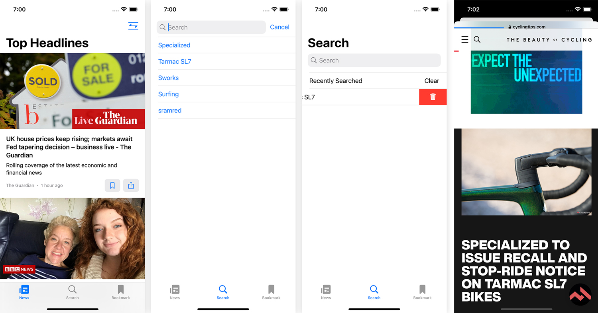

# SwiftUI_NewAppWithNewsAPI

built a Full News App using SwiftUI 3 from scratch to finish that fetches latest news from newsapi.org, 
with using Async Await, Structured Concurrency, Actors, AsyncImage, Refreshable, SwipeActions, Searchable 

